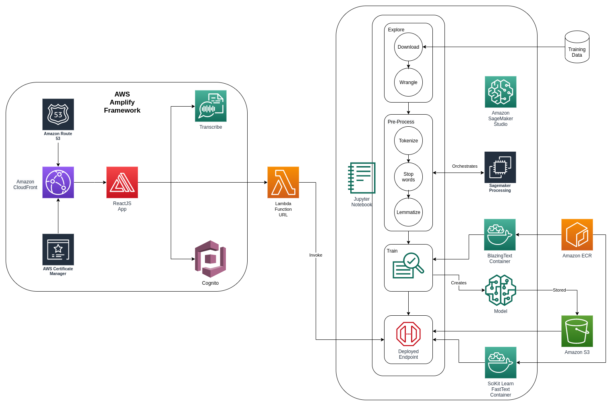
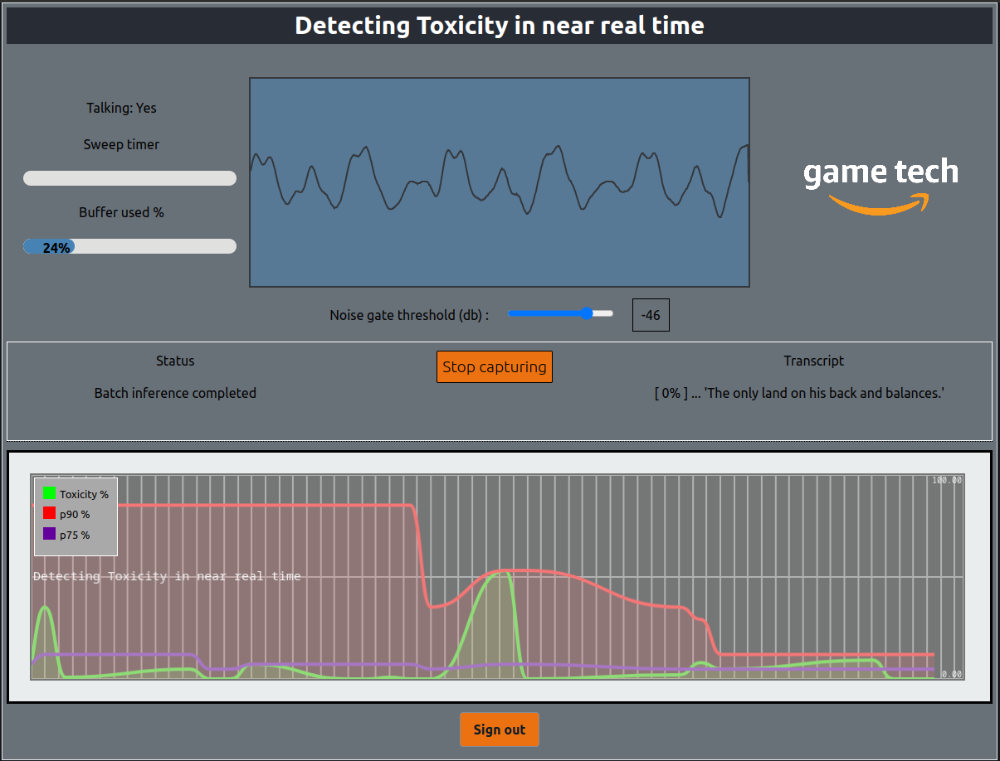

# Realtime Toxicity Detection

 

- [A cost effective approach to detecting Toxicity in Game chat in near real time](#a-cost effective-approach-to-detecting-toxicity-in-near-real time)
- [What is toxicity?](#what-is-toxicity)
- [Design considerations](#design-considerations)
- [High Level Architecture](#high-level-architecture)
- [Architecture Diagram](#architecture-diagram)
- [Deployment Steps](#deployment-steps)
- [License](#license)

This repository contains a complete solution for detecting toxicity across voice and text chats, cost efficiently and at scale, in near real time. 
It makes use of a number of Serverless and Fully Managaed AWS services, including Amazon SageMaker, Amazon Cognito, AWS Lambda, AWS Amplify, and Amazon Transcribe. 
Whilst it uses Artificial Intelligence (AI) and Machine Learning (ML) services, it requires no expert knowledge in these domains. 

This Readme includes the architecture overview, as well as deployment instructions and documentation for the solution.

**Note**: “The sample code; software libraries; command line tools; proofs of concept; templates; or other related technology (including any of the foregoing that are provided by our personnel) is provided to you as AWS Content under the AWS Customer Agreement, or the relevant written agreement between you and AWS (whichever applies). You should not use this AWS Content in your production accounts, or on production or other critical data. You are responsible for testing, securing, and optimizing the AWS Content, such as sample code, as appropriate for production grade use based on your specific quality control practices and standards. Deploying AWS Content may incur AWS charges for creating or using AWS chargeable resources, such as running Amazon EC2 instances or using Amazon S3 storage.”

# What is toxicity?

Toxicity has been a growing problem in multiplayer games and their surrounding communities for a while, having the effect of holding back growth, deterring players and impacting on the communities that have been using these games as a way to stay connected to friends and family. 
It remains largely unsolved because of the scale of modern multiplayer games, with potentially thousands of concurrent players connected and communicating simultaneously. 

# Design considerations

We are aware that content moderation and toxicity detection is a requirement of good community relations, rather than a cool game feature, and so the primary design goal is to be cost efficient, giving you the confidence to use the solution knowing that it will scale efficiently as your community grows. 
Some of this can be achieved through component selection, by using the serverless and fully managed service categories, such as [Amazon SageMaker Serverless Inference](https://aws.amazon.com/sagemaker/deploy/). 

This will get our per user cost on the backend components into an optimized position, where we only pay for inferences as we make them. 
This model of resource usage on the backend allows us to really minimize the costs across the whole solution by minimizing the amount of information we process at the start of our inference funnel. 

Another guiding principle for us is that it should take as little effort to run as possible, and not take time away from you building core game features. 
To support this we will keep the infrastructure component count as low as possible, and look to fully managed and serverless auto scaling services. 

Breaking the problem down into its components we can pick a couple of them up without building anything ourselves, such as 

- choosing the [Amazon Transcribe](https://aws.amazon.com/transcribe/) service to convert our speech to text before passing it along for toxicity inference
- choosing [Amazon Cognito](https://aws.amazon.com/cognito/) to handle Authentication, Sign up and Sign in flows

while we will have to build the domain specific toxicity model ourselves in Amazon SageMaker. 

From the ML perspective, we will use the features of the Amazon SageMaker Machine Learning platform for the heavy lifting of pre-processing data, training, and making realtime predictions, as well as the SageMaker Studio IDE as our entry point. 

With SageMaker you can quickly and easily build and train ML models, and then directly deploy them into a production-ready hosted environment, using appropriate hardware at each stage for optimal efficiency. 
We will also re-use our own pre-processing code for the training and inference stages, backed by the optimized algorithms and containers provided by the platform. 

We can commit to processing the audio on the client side, for a couple of reasons. 

- #1) So we can determine clearly what is being said if more than one person speaks simultaneously, which would be very difficult on a merged audio stream
- #2) Processing on the client side lets us identify who the speaker is trivially

A good side effect of pushing this responsibility to the client is that it also allows us to implement a greaceful UI to warn someone if their language is degrading, and maybe act on it locally.

# High Level Architecture

This solution has 4 principle components to it, provided by components in the serverless or fully managed services categories of AWS services. 

### 1. Client side user interface

For this we will deploy a small React app, using [AWS Amplify](https://aws.amazon.com/amplify/), a multi language framework and tool chain that lets developers quickly, easily and securely build and deploy front end applications on AWS. 
The web application hosting is managed by Amplify, and it offers tight integration into many AWS services, making feature rich application development trivial.

### 2. Authentication

We need authentication not only so we can identify the speaker, but also to secure our transcription endpoint, restricting it to our application front end. 
The Amplify framework provides an out of the box integration with [Amazon Cognito](https://aws.amazon.com/cognito/), a fully managed identity service that offers simple and secure authentication and federation, with a out of the box web UI for the most common journeys - sign up, sign in, password reset. 

### 3. Transcription

Amplify also provides a seamless, authenticated integration to the suite of AI services, and as part of our frontend applications configuration we can get Amplify to integrate and deploy a transcription endpoint for, us leveraging [Amazon Transcribe](https://aws.amazon.com/transcribe/), a serverless automatic speech recognition (ASR) service.

### 4. Toxicity detection

To implement the core of our solution we will make use of a number of features of the Amazon SageMaker platform. 
We know that it is a Natural Language Processing (NLP) problem, and in these situations there is usually a lot of pre-processing of the text to do; to clean it and prepare it for training and inference. 
Here we will use the Processing component of the SageMaker platform, letting use pick suitable sized compute and memory for the pre-processing as well as the training stages, and have SageMaker manage it for us.
We can use the Blazing Text algorithm for training, and we know we want to deploy a real time inference endpoint for making live predictions against. To support this, we can use the SageMaker SciKit Learn Container with fastText installed on it, allowing us to pre-process the input on the fly, using the same code as the pre-processing stage.

### Ad-hoc Integrations

To bridge between our Amplify frontend UI and our deployed SageMaker inference endpoint we will use a small [AWS Lambda](lambda/function.py) function, marshalling the request between the two services via the new [Function URL](https://docs.aws.amazon.com/lambda/latest/dg/lambda-urls.htm) HTTP endpoints.

# Architecture Diagram

# Deployment Steps

## 1. Training and deploying the model using Amazon SageMaker Studio

We use Amazon SageMaker Studio IDE as a single place to inspect our dataset, train and deploy our model. 
To create your Amazon SageMaker studio IDE and run through these steps, please follow [this guide](notebooks/README.md).

## 2. Exposing our trained Model via a Lambda Function URL

We use AWS Lambda to expose the Amazon SageMaker Serverless Inference Endpoint to our frontend via the new Function URL feature, locked down with IAM Authentication, enabled by Amazon Cognito. 

To deploy the Lambda function, please follow [the steps here](lambda/README.md).

## 3. Deploying our frontend Amplify website

The front end has two primary responsibilities in our solution, cost efficiency and behaviour controls, and is powered by AWS Amplify, which removes the heavy lifting of providing authentication and authorization to our supporting services, as well as a fully managed hosting platform. 

Please follow [these steps](website/README.md) to deploy the Amplify frontend.

## Testing the solution

When you have completed the previoussteps, you can sign up, login, and test the end to end solution using the url we got from running the `amplify publish` command earlier.
You need to allow the site access to your microphone in your web browser, when it asks. 

# License

This example is licensed under the Apache 2.0 License. See LICENSE file.
