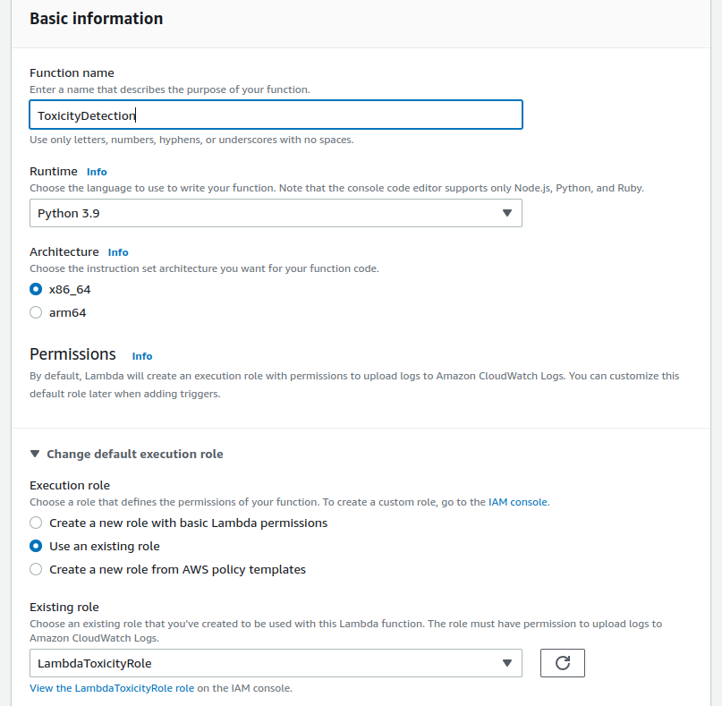
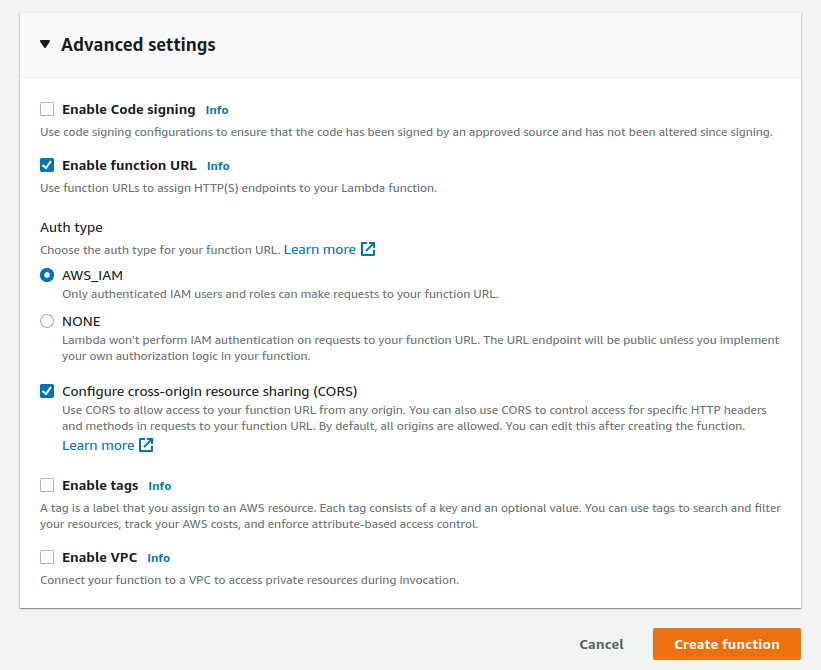
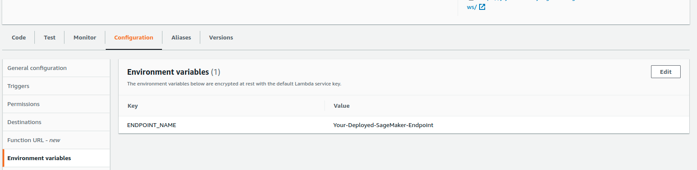
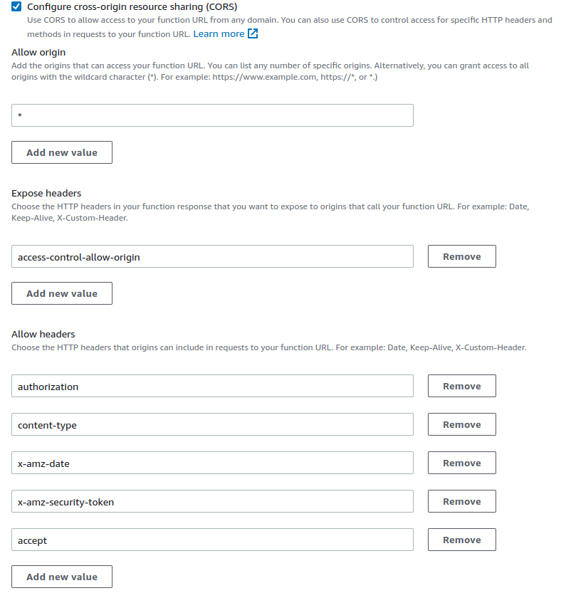

# Exposing our SageMaker inference endpoint via a Lambda function URL

- [Exposing our SageMaker inference endpoint via a Lambda function URL](#exposing-our-sagemaker-inference-endpoint-via-a-lambda-function-url)
- [Deployment Steps](#deployment-steps)
- [Next Steps](#next-steps)
- [Cleanup](#cleanup)

By this stage, we have a trained and deployed toxicity prediction model, but we need to expose it, securely, for our front end to consume. 
To achieve this we will use a serverless AWS Lambda function, securely exposed via a Function URL.

# Deployment steps

## Pre-requisites

We need to use our SageMaker Inference Endpoint *ARN* and *Name* from training and deploying our model in the [first step](../notebook/README.md). 
To find this information

- Open the [Amazon SageMaker Console](https://console.aws.amazon.com/sagemaker/home?)
- Expand the Inference menu
    - Under `Endpoints`
        - find your Endpoint from the name displayed from your notebook run
        - under Endpoint Settings you'll find 
            - the *Name* field, similar to `sagemaker-scikit-learn-YYYY-MM-DD-HH-mm-ss-nnn`
            - the *ARN* which should look like `arn:aws:sagemaker:[region]:[account]:endpoint/[EndpointName]`

## IAM permissions

### Creating our custom policy

First we will create an IAM  policy to let our Lambda function invoke our SageMaker endpoint.

- Open the [Identity and Access Management Console](https://console.aws.amazon.com/iam/home?)
- Select `Access management` and then `Policies` from the left hand navigation
- Choose `Create policy`
- In the JSON tab, enter the following statement, changing the `Resource` to our Inference Endpoint ARN created from deploying our model

```json
{
    "Version": "2012-10-17",
    "Statement": [
        {
            "Sid": "LambdaInvokeSageMakerToxicityEndpointSID",
            "Effect": "Allow",
            "Action": "sagemaker:InvokeEndpoint",
            "Resource": "arn:aws:sagemaker:[region]:[account]:endpoint/sagemaker-scikit-learn-YYYY-MM-DD-HH-MM-SS-nnn"
        }
    ]
}
```

- Select `Next: Tags` to go to the optional Tags configuration page
- Press `Next: Review` to get to the final step
    - Enter `LambdaInvokeSageMakerToxicityEndpoint` as the policy name
    - Enter `Permission for a Lambda Function to invoke our SageMaker Toxicity endpoint` for the description
    - Select `Create policy`


### Creating our Role

Now we will use this policy inside an IAM Role which we will assign to our Lambda function.


- Select `Access management` and then `Roles` from the left hand navigation
- Choose `Create role`
- Leave the `Trusted entity type` as `AWS Service` and for `Use case` select the `Lambda` option.
- Press `Next` and we can begin to add permissions to our policy
    - In the `Permission policies` search box type `AWSLambdaBasicExecutionRole` and select the result
        - If there is more than one result, select the AWS managed policy, denoted by the AWS icon
    - Clear the search filters using the `Clear filters` button
    - In the `Permission policies` search box type `LambdaInvokeSageMakerToxicityEndpoint` and select the result
      - If there is no result, make sure you type the name you gave the policy in the previous step
- Press `Next` to review and create our IAM Role
    - Enter `LambdaToxicityRole` for the Role name
    - Enter `Permission for a Lambda Function to invoke our SageMaker Toxicity endpoint` for the Description
- Select `Create role`

## Lambda

At this point we can create our Lambda function, by following these steps: 

- Download the [Lambda function](./index.py) locally to you if you haven't cloned the repo
- Open the [AWS Lambda Console](https://console.aws.amazon.com/lambda/home?) and select the *Create Function* button
- Create the function with the following options
    - Select `Author from scratch`
    - In `Basic settings` set 
        - Function name : `ToxicityDetection`
        - Runtime : `Python 3.9`
        - Expand `Change default execution role` under `Permissions`
          - For `Execution role` select `Use an existing role`
          - In the `Existing role` drop down select our newly created role : `LambdaToxicityRole`
        - 
    - Under `Advanced Settings` 
        - Select `'Enable Function URL'`
            - Set Auth type : `AWS_IAM`
        - Select `'Configure cross-origin resource sharing (CORS)'`
        - 
    - Press `Create Function`, and you will be taken to a window showing the function overview and code editor
    - Open the function code locally in a text editor, and paste it into the code editor window
    - Press the `Deploy` button to save and publish your function

### Configuration

We use an environment variable to tell the Lambda function the SageMaker Inference endpoint *Name* that we got earlier. 
To configure this we take the following steps:

- Select the `Configuration` tab, and then `Environment Variables` from the left navigation.
- 
- Select `Edit`, and then `Add Environment Variable`
    - Set the `Key` as `ENDPOINT_NAME` and the `Value` to the SageMaker Inference Endpoint *Name*
    - Press `Save`

We invoke this endpoint with Javascript from our front end, and so CORS needs to be enabled on our Function URL, and certain HTTP Headers need to be configured. 
To do this, take the following steps :

- Select the `Function URL` menu item from the left navigation, under the `Configuration` tab
- Press the *edit* button and add a wildcard (*) for the `Allow origin` CORS parameter
- Under `Expose headers`:
    - Select `Add new value` and enter : `access-control-allow-origin`
- Under `Allow headers`:
    - Select `Add new value` and enter : `authorization`
    - Select `Add new value` and enter : `content-type`
    - Select `Add new value` and enter : `x-amz-date`
    - Select `Add new value` and enter : `x-amz-security-token`
    - Select `Add new value` and enter : `accept`
- Under `Allow methods`:
    - Make sure `*` is selected
- Save your changes

The results should look something like this: 



### Test

At this stage we have linked our SageMaker Inference Endpoint to our AWS Lambda function, and given it a secure but publicly addressable HTTPS URI. 
We don't need to pre-process the text, as this is taken care of by our SageMaker Inference Endpoint. 

From the `Configuration` menu, select `Function URL` from the left navigation, and from there you will see the URL address. 
Click it and it will open in a new tab and throw an HTTP 403 error : `{"Message":"Forbidden"}` as we haven't authenticated to it yet. 

So, to test our function is working in conjunction with SageMaker, we can configure a Lambda Test. 

- Select the `Test` tab, and `Create new event`
- Enter a suitable `Event name`
- In the `Event JSON` text box paste the following statement
```json
{
  "queryStringParameters": {
    "k": "3",
    "q": "who am i"
  }
}
```
- You can now run our configured test by selecting `Test`

You should get a result similar to the following : 

```json
[
  [ "__label__none", "__label__toxic", "__label__obscene" ],
  [ "0.9797907", "0.02019908", "3.6296085e-05"
  ]
]
```

The `None` category in this case is dominant, with a 98% likelyhood, which makes sense, as the example wasn't toxic.

If your function times out after 3 seconds, then this is likely because your serverless Inference Endpoint has scaled down to zero. Try again after a couple of minutes when a new endpoint has launched. 

# Next steps

With our Lambda function set up, we can now continue to deploying our [Amplify website](../website/README.md), or return to the [Overview](../README.md).

# Cleanup

To remove the Lambda function, please 
- Open the [AWS Lambda Console](https://console.aws.amazon.com/lambda/home?)
    - Type `ToxicityDetection` into the search bar
    - Select your Lambda function with the checkbox
    - Choose `Actions` -> `Delete`
    - Type `delete` into the prompt, and confirm the deletion
- Open the [Identity and Access Management Console](https://console.aws.amazon.com/iam/home?)
- Select `Access management` and then `Roles` from the left hand navigation
    - Find and delete the `LambdaToxicityRole` IAM Role
- Select `Access management` and then `Policies` from the left hand navigation
    - Find and delete the `LambdaInvokeSageMakerToxicityEndpoint` IAM Policy
