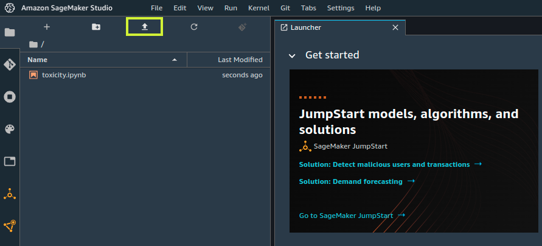
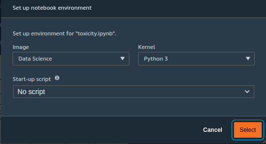

# Training and deploying our model with Amazon SageMaker Studio

- [Training and deploying our model with Amazon SageMaker Studio](#training-and-deploying-our-model-with-amazons-sagemaker-studio)
- [Design decisions](#design-decisions)
- [Deployment Steps](#deployment-steps)
- [Next Steps](#next-steps)
- [Cleanup](#cleanup)

At the heart of all ML NLP problems are the four stages of data exploration, pre-processing, training and inference. To achieve our goal of being cost efficient across the whole project, we will take full advantage of the SageMaker platform features that enable this, using the right sized compute for each task, and delegating the processing to different fully managed platform features to achieve this. 

We will use the SageMaker Studio IDE as our single pane of glass for this stage of the solution, as it exposes all the platform features we need, and more. If you don't yet have a SageMaker Studio Domain setup, there is a [quick start wizard](https://docs.aws.amazon.com/sagemaker/latest/dg/onboard-quick-start.html) in the AWS console.

The SageMaker Platform components we will be using include 

- A fully managed web based [Jupyter Lab IDE](https://docs.aws.amazon.com/sagemaker/latest/dg/studio.html)
- SageMaker [SkLearn processing](https://docs.aws.amazon.com/sagemaker/latest/dg/use-scikit-learn-processing-container.html) environment for offloading our NLP pre-processing onto appropriately sized compute
- The platform provided highly optimized [BlazingText](https://docs.aws.amazon.com/sagemaker/latest/dg/blazingtext.html) algorithm
- The platform provided [SciKit Learn container](https://docs.aws.amazon.com/sagemaker/latest/dg/pre-built-docker-containers-scikit-learn-spark.html)
- [Managed training](https://docs.aws.amazon.com/sagemaker/latest/dg/train-model.html)
- Deploying a fully managed [serverless inference endpoint](https://docs.aws.amazon.com/sagemaker/latest/dg/serverless-endpoints.html) for realtime predictions


We will train using the publicly available Jigsaw Multi Category toxicity dataset [provided by Kaggle](https://www.kaggle.com/c/jigsaw-toxic-comment-classification-challenge). 
If you've your own labelled dataset available, even better, as it will reflect your customers and community specific slang and dialect, and give better results.

The schema contains the following categories, and a comment can be assigned to zero or more of them.

- toxic
- severe_toxic
- obscene
- threat
- insult
- identity_hate

Having this multi-category classification granularity can be a good feature to support your community. 
For example, in an adult rated ([USK 18, ESRB A etc](https://en.wikipedia.org/wiki/Video_game_content_rating_system)) Player vs. Player First Person Shooter (PvP FPS) style game, swearing might be fine, or even a configuration item, allowing opt in by the players, whilst threats, hate speech and toxic chat would always be unacceptable. 

With this in mind we can browse through the SageMaker documentation that descibes [the use cases for each built in algorithm](https://docs.aws.amazon.com/sagemaker/latest/dg/algos.html) and find the best candidate. 
For Multi Classification of text we want to use BlazingText, a highly optimized inplementation of the fastText algorithm. 

In the documentation for the [the algorithm details](https://docs.aws.amazon.com/sagemaker/latest/dg/blazingtext.html), we can see that we have to configure it for training in *supervised mode* since this is a classification problem. 
Supervised mode means that we will provide labelled data for the algorithm to learn from, in contrast to unsupervised, where the algorithm uses statistical means for classification, like clustering or proxiity. 
The documentation also describes, with an example, the format we need to get our train and test datasets into, to be compatible with the BlazingText and fastText algorithms. 
This is one row per example, preceeded with the list of categories, prefixed with *__label_*. 

```
__label__CategoryA __label_CategoryN Some text for training
```

# Design decisions

In this solution, to keep the focus on the problem at hand, we are minimizing the number of services and steps we use. For our live inference endpoint, we are injecting our NLP components onto a base Scikit Learn container at launch, adding a few minutes before the endpoint is live. Using Serverless Inference, the compute behind the endpoint can scale to zero after a period of non-utilization. In a production environment you would likely want to create a finalized container, with all dependencies baked in, to remove this startup time penalty. 

# Deployment steps 

### Building the model in SageMaker Studio

- After checking we meet the [pre-requisites](https://docs.aws.amazon.com/sagemaker/latest/dg/gs-set-up.html), we'll start by creating a [SageMaker Studio domain](https://docs.aws.amazon.com/sagemaker/latest/dg/onboard-quick-start.html).
- At the end of the creation process, we should be logged in into the SageMaker Studio app, as explained under "_To access Studio after you onboard_", in the quick start guide above. 
- Next, if you haven't checked out this repo locally, save the raw [Jupyter Notebook](./toxicity.ipynb) to your local machine. 
- In the SageMaker Studio IDE, upload the notebook by pressing the up arrow and selecting the local file, resulting in it being displayed in the file browser window. 



- Double click on the notebook to open it in the main editor window, and it will prompt you to select the kernel to use. Select the *Data Science* Image and *Python 3* Kernel. 



- Next, we run the fully annotated Notebook which walks you through
    - Downloading the synthetic dataset
    - Exploring the data
    - Pre-processing the data for training using SageMaker processing
    - Training using managed training and the BlazingText algorithm provided by SageMaker
    - Deploying our model to a real time serverless inference endpoint using the SciKit Learn container provided by SageMaker, with fastText installed on top

# Next steps

With our model trained and deployed, we can now continue to expose it to our front end using a [Lambda Function URL](../lambda/README.md), or return to the [Overview](../README.md).

# Cleanup

SageMaker Serverless Inference points come with no cost attached when not being invoked, but if you would like to completely remove this solution, please

- Open the [Amazon SageMaker Console](https://console.aws.amazon.com/sagemaker/home?)
- Expand the Inference menu
  - Under `Endpoints`
    - find your Endpoint from the name displayed from your notebook run
    - select it, and from `Actions`, choose `Delete` and confirm the deletion
  - Under `Endpoint configurations`
    - find your Endpoint Configuration with the same name as the endpoint
    - select it, and from `Actions`, choose `Delete` and confirm the deletion
  - Under Models
    - find your Model with the same name as the endpoint
    - select it, and from `Actions`, choose `Delete` and confirm the deletion
