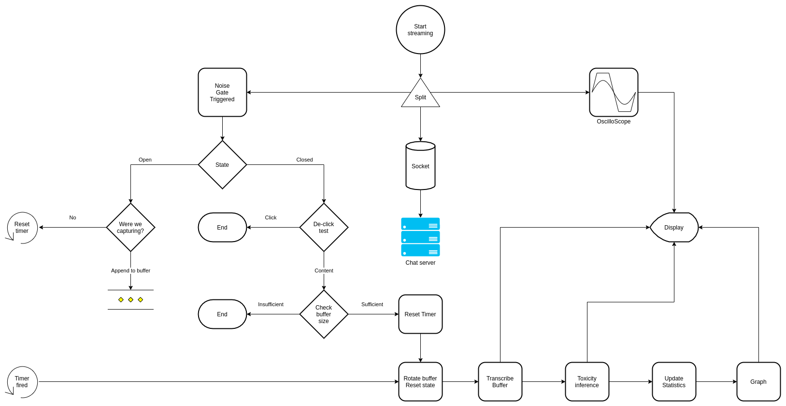
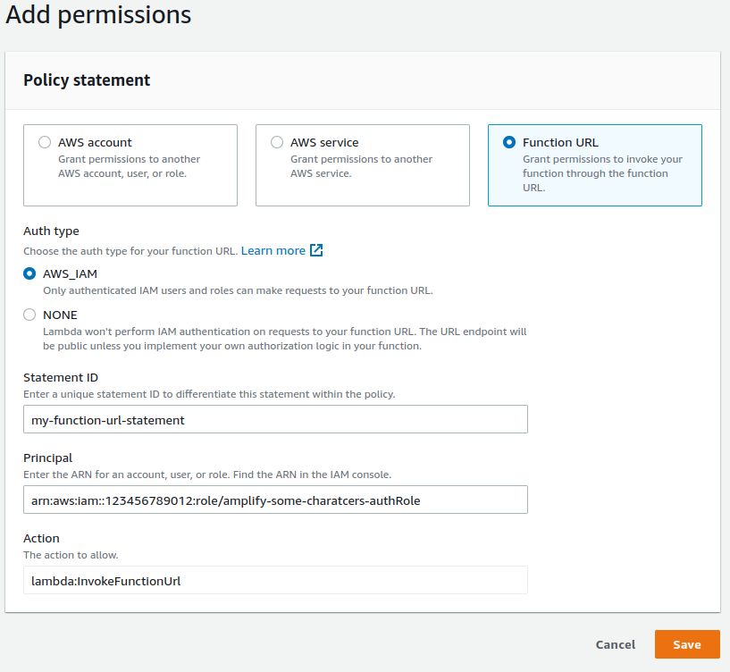

# Deploying our frontend Amplify website

- [Deploying our frontend Amplify website](#deploying-our-frontend-amplify-website)
- [Client Side Architecture](#client-side-architecture)
- [Anatomy of the application](#anatomy-of-the-application)
- [Deployment Steps](#deployment-steps)
- [Next Steps](#next-steps)
- [Cleanup](#cleanup)

In this section we deploy and configure our applications frontend UI, where we can visualize the solution. 
To accelerate things we will use AWS Amplify, a fully managed, serverless, static website hosting service that integrates a numbe rof other AWS service's for us, like Amazon Cognito for authentication and authorization, and Amazon Transcribe, an AI service for transcribing audio.

Before we jump into the deployment and configuration of the managed ReactJS application, we will have a brief look at the design considerations involved in making this solution viable. 

## Cost efficiency

The problem with a naive implementation of a solution is that the cost efficiency drops with each extra person on the chat. 
If we compound this with the recent societal shift of people turning to social games as a way to remain connected to friends and family during lockdowns, we have a very difficult problem indeed. 
As an example, with 500 people on a voice chat with a single hours duration, we would have to transcribe 500 hours of audio stream, putting us at [O(n)](https://en.wikipedia.org/wiki/Big_O_notation) linear scaling, which simply doesn't work. 
We need to be somewhere between O(1) and O(log n) to be cost viable, where adding more people ot the chat stream has only a small impact on cost.


This allows us to act on the client side, supporting the identification requirement, whilst only processing meaningful audio. 
This is much more cost efficient than an *always on* streaming approach from every client, and likely to be more efficient than processing the server side on a fully multiplexed stream, too, whilst avoiding the complexity of multiple simultaneous speakers.


We can also use our service pricing model to guide our solution. For non streaming transcription, the smallest amount of audio that you will be billed for is 10 seconds at a time, which tells us we should implement a noise gate and an audio buffer on our client. 
These will allow us to add to an audio buffer only when the person is talking. The principle of a noise gate is that below a specified volume threshold it is considered to be in a closed state, and no audio passes. 
When this threshold is exceeded, the gate opens, and all audio passes, until the volume drops again below the set threshold. 
Professional audio noise gates have other controllers such as Attack and Release rate modifiers, to smoothen the opening and closing of the gate, but these aren't necessary here.

When the noise gate closes, either because of a logical semantic pause, a breath or a sentence end, we can evaluate the size of the buffer contents. 
If it exceeds our 10 second threshold then we can send it for transcription. To ensure that all audio is ultimately processed without excessive latency we can implement a sweeper timer that sends any remaining content in an audio buffer, however small, when it becomes 30 seconds old. 

# Client Side Architecture

Adding in some visual elements to demonstrate speech volume, noise gate status, the sweeper timer position and the buffer size, we end up with the following flow. 



# Anatomy of the application

The react app is made up of 7 files

| File name       | Responsibility |
|-----------------|----------------|
| [App.css](./src/App.css)         | Styling our application |
| [App.js](./src/App.js)          | The majority of our business logic |
| [MyTimeSeries.js](./src/components/MyTimeSeries.js) | Trending percentile and visualization code based on the open source [react-smoothie](https://github.com/cinderblock/react-smoothie) library |
| [StreamFilter.js](./src/components/StreamFilters.js) | An implementation of a Noise Gate and Oscilliscope that attach to our audio stream |
| [Progress.js](./src/components/Progress.js) | An implementation of a simple progress bar for our UI buffer |
| [TimerProgress.js](./src/components/TimerProgress.js) | An implementation of timer driven progress bar, for our sweeper function |
| [StepInput.js](./src/components/StepInput.js) | An implementation of a slider input ui component |

The time series, noise gate and Oscilliscope components all behave the same way, connecting to your browsers `mediaDevices` audio stream api, and driven by a simple `requestAnimationFrame` loop.

For the trends, points on the time series graph are rendered with a direct weight from the prediction, and also calculated as 90 and 75 percentiles, over a rolling window, and rendered.

Creation of the noise gate is trivial, based on the audioContext createAnalyser method. We provide an initial cut off frequency, which is the latching point of the gate. 
The buffer is a Javascript Array, and we add a couple of event callbacks (`noiseGateOpensCallback` and `noiseGateClosesCallback`) to notify the main App.js code that the gate has opened or closed.

Excerpt from `StreamFilter.js`:

```js
this.audioCtx = new AudioContext();
this.analyser = this.audioCtx.createAnalyser();
this.analyser.minDecibels = this.thresholdDB;
this.dataArray = new Uint8Array(this.analyser.frequencyBinCount);
```

These stream filters are instantiated and connected in the ToxicTest.js `startTransmitting` function, passing in 2 handlers for our noise gate, `gateOpens` and `gateCloses`. 


Excerpt from `ToxicText.js`:

```js
let myScope = new Scope( {id:"myScope"} );
myScope.connectTo(stream);
this.noiseGate = new NoiseGate({
        noiseGateClosesCallback:this.gateCloses, 
        noiseGateOpensCallback: this.gateOpens, 
        thresholdDb: this.state.threshold
    } 
);
this.noiseGate.connectTo(stream);
myMic.setStream(stream);
myMic.on('data', (chunk) => {
    if (this.state.talking) {
        const raw = mic.toRaw(chunk);
        if (raw == null) {
            return;
        }
        this.audio.addData(raw);
    }
});
```

This lets us implement the trigger for a sweeper timer, and the closing of our noise gate. 
Either of these events can call the `send` function. The sweeper timer timeout forces the 10 seconds buffer contents check to be bypassed, guaranteeing a send. 
Before the existing buffer is sent for transcription, a new one is created and attached to the stream, for new inputs. 
When the function is called by the noise gate closing, we measure the size of the buffer by comparing its size to 10 * the audio streams Sample Rate, ensuring it contains more than 10 seconds of audio. 


Excerpt from `ToxicText.js`:

```js
const resultBuffer = this.audio.getData();
const payloadSize = resultBuffer.length;
if ( force || (payloadSize > (10 * this.state.sampleRate)) ) {
    this.audio.reset();
    this.sweeper.current.reset();
    this.calculateBufferUsed();
    this.transcribeBuffer(resultBuffer);
    ...
}
```

This in turn uses the Amplify predictions API to send the audio bytes to Transcribe securely, and get back the text, with the the `transcribeBuffer` function. 
This is implemented as a javascript Promise, using the Amplify Predictions helper.

Excerpt from `ToxicText.js`:

```js
Predictions.convert({
    transcription: { source: { bytes } },
})
.then(
    ({ transcription: { fullText } }) => {
        if (!fullText) {
            this.setResponse("No words detected");
            return;
        }
        this.getPrediction(fullText);
    }
)
```

The transcription text is passed to our `getPrediction` function, and sent to our Lambda HTTP functionURL endpoint via the Amplify API class, which signs the request for us with SigV4, enabling IAM authentication to protect out Lambda function from being invoked by anyone. 
The resulting prediction is parsed, and a total toxicity score is calculated from the category weights, and sent to the time series componentfor percentile calculation and display.

Excerpt from `ToxicText.js`:

```js
API.get(apiName, path, { "Accept": "application/json" }).then(response => {
.then((data) => {
    let strData = JSON.stringify(data);
    let toxicScore = this.getScore(data);
    let output = "[ " + toxicScore + "% ] ... '" + message + "'";
    this.setResponse(output);
    this.tsRef.current.processor.addData(toxicScore);
})};
```

To customize the behaviour of the solution, like ignoring a category for opted in players etc, the function `getPredictions` would be the place to do it.

# Deployment steps

Deploying Amplify solutions is a guided process, orchestrated by the Amplify Command Line Interface (CLI). 
To install and configure the CLI tool, please follow [the guide](https://docs.amplify.aws/cli/start/install/) for your operating system. 

Amplify requires an Administrator level account when you first configure it, so it makes sense to make sure you have a suitable access policy applied to your user. 
To set this up, you can follow [this walkthrough](https://docs.aws.amazon.com/IAM/latest/UserGuide/getting-started_create-admin-group.html).

Once setup, configuring and deploying an Amplify app is achieved by responding to a few configuration questions, and selecting which AWS features and services you want to include in your application. 

There is a helper script to run through this with you in the code repo. 

Change into the amplify directory locally and run the following command for linux and mac users : [`./setup.sh`](amplify/setup.sh), and [`.\setup.ps1`](amplify/setup.ps1) for Windows powershell users.
It orchestrates the following steps, that you can also run manually : 

- it
  - checks amplify is installed and setup
  - requests from you the url endpoint of our Lambda function
  - installs dependencies (`npm i`)
  - writes out a settings file containing the Lambda function URL endpoint for our react app to use (`./src/toxicity-settings.json`)
  - starts the Amplify configuration, prompting you how to answer for each section
    - the steps are : 
      - `amplify init`
      - `amplify add auth`
        - Just accept all the defaults, and it will stand up a simple authentication flow using username, password, and an email confirmation flow
      - `amplify add hosting`
        - Select the defaults here, hosting with Amplify Console, and then manual deployment
      - `amplify add predictions
        - Here we choose `convert`, `Transcribe text from audio`, give a friendly name to our transcriber, for language use `British English`, and lock it down to `Auth users only`

Now we can deploy the application by running `amplify publish`. 
This will push the infrastructure live, wire up permissions, and bundle our app up and deploy it, emitting the URL where you can sign in and test the solution

## Integrate our Lambda function

We have one last aspect to configure now, which is binding our Lambda function to our Amplify application. 

- Open the [Amazon Cognito Console](https://console.aws.amazon.com/cognito/home?)
- Select `Federated Identities`, and then the Identity Pool created by Amplify
- Select `Edit identity pool`, and find the name of your `Authenticated role`
- Browse to the IAM service, select `Roles` from the `Access Management` menu, and search for the IAM Role we just identified
- Copy its ARN

Now we need to update your Lambda function, binding its access to our Cognito deployment.

- Open the [AWS Lambda Console](https://console.aws.amazon.com/lambda/home?), and select our `ToxicityDetection` function
- Select `Configuration`, and then `Permissions`
- Scroll down to `Resource-based policy statements`, and select `Add permissions`
- Choose `Function URL`
- For `Auth Type` select `AWS_IAM`
- Enter a name for the policy Statement ID
- Enter the IAM Role ARN for the `Authenticated role` you copied above into the `Principal` field
- Select `Save`

It should look something similar to this. 



### Local testing

This project was bootstrapped with [Create React App](https://github.com/facebook/create-react-app).
In the project directory, you can run: `npm start`, which runs the app in the development mode. 
Open [http://localhost:3000](http://localhost:3000) to view it in your browser.
The page will reload when you make changes. You may also see any lint errors in the console.

# Next steps

With our front end deployed we can now return to the [Overview](../README.md) and test it.

# Cleanup

To delete the hosted website and all thecomponents that Amplify created for us, please run `amplify delete` in this directory, from the command line
